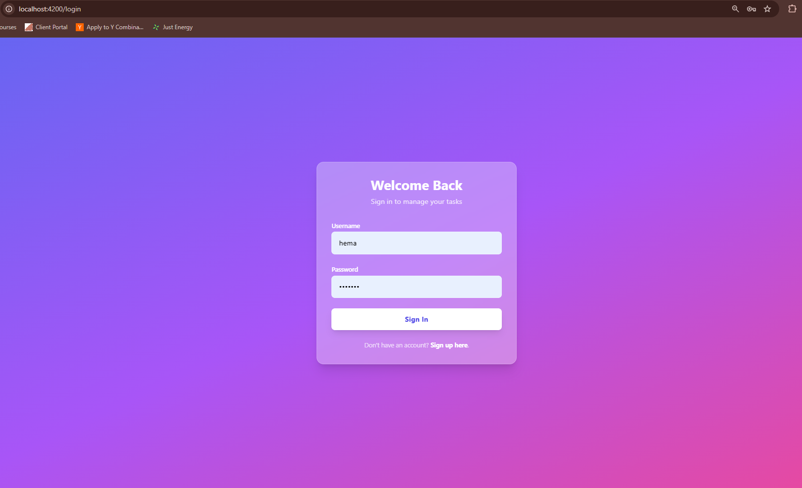
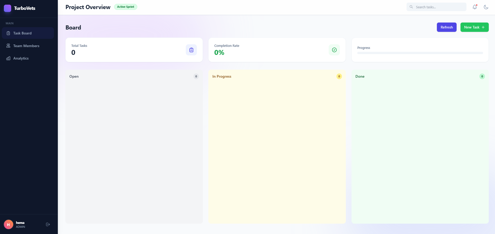
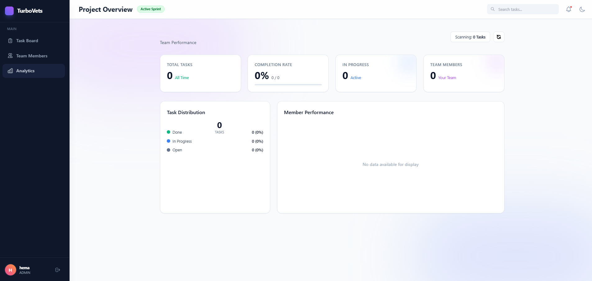
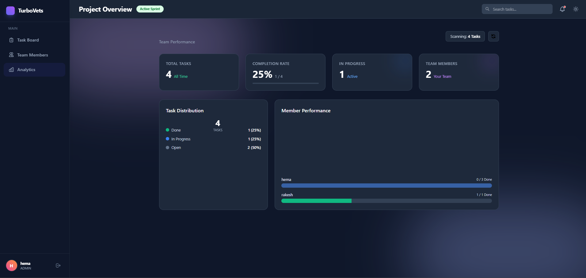

<div align="center">

# Secure Task Management System

### Full-Stack Assessment Project for TurboVets

[](https://nestjs.com/)
[](https://angular.io/)
[](https://www.typescriptlang.org/)
[](https://tailwindcss.com/)

_A modern, secure, role-based task management system with a beautiful UI and robust backend_

[Features](#features) • [Quick Start](#quick-start) • [Architecture](#architecture) • [API Documentation](#api-documentation) • [Screenshots](#screenshots)

</div>

---

## Table of Contents

- [Overview](#overview)
- [Features](#features)
- [Technology Stack](#technology-stack)
- [Prerequisites](#prerequisites)
- [Quick Start](#quick-start)
- [Architecture](#architecture)
- [Database Schema](#database-schema)
- [API Documentation](#api-documentation)
- [User Roles & Permissions](#user-roles--permissions)
- [Screenshots](#screenshots)
- [Testing](#testing)
- [Project Structure](#project-structure)
- [Security](#security)
- [Contributing](#contributing)

---

## Overview

This is a **full-stack task management application** built with modern technologies, featuring:

- 🔐 **Secure Authentication** with JWT tokens
- 👥 **Role-Based Access Control** (RBAC) with three distinct roles
- 📊 **Kanban-style Task Board** with drag-and-drop functionality
- 🎨 **Modern, Responsive UI** with dark mode support
- 📱 **Mobile-Friendly** design that works on all devices
- 🏢 **Organization Hierarchy** for multi-tenant support
- 📝 **Audit Logging** for security and compliance
- 📈 **Analytics Dashboard** with task insights

---

## Features

### 🔐 Authentication & Authorization

- ✅ JWT-based secure authentication
- ✅ Password hashing with bcrypt
- ✅ Auto-login with token persistence
- ✅ Protected routes and API endpoints
- ✅ Role-based access control (OWNER, ADMIN, VIEWER)

### 📋 Task Management

- ✅ **Create** tasks with title, description, and assignee
- ✅ **Read** all tasks in a beautiful Kanban board
- ✅ **Update** tasks via edit modal or drag-and-drop
- ✅ **Delete** tasks with confirmation dialog
- ✅ Drag-and-drop between status columns
- ✅ Real-time status updates
- ✅ Task filtering and search

### 🎨 User Interface

- ✅ Modern, clean design with TailwindCSS
- ✅ Dark mode / Light mode toggle
- ✅ Smooth animations and transitions
- ✅ Responsive layout (mobile, tablet, desktop)
- ✅ Intuitive navigation
- ✅ Color-coded task statuses

### 📊 Analytics & Reporting

- ✅ Task statistics dashboard
- ✅ Completion rate tracking
- ✅ Task distribution charts
- ✅ Team performance metrics
- ✅ Recent activity feed

### 👥 Team Management

- ✅ View all team members
- ✅ User role display
- ✅ Organization hierarchy
- ✅ Manager-subordinate relationships

### 🔒 Security & Compliance

- ✅ Audit logging for all actions
- ✅ Access logs stored in `access.log`
- ✅ Input validation and sanitization
- ✅ SQL injection prevention
- ✅ XSS protection

---

## Technology Stack

### Backend

- **Framework**: NestJS (Node.js)
- **Database**: SQLite with TypeORM
- **Authentication**: Passport.js + JWT
- **Validation**: class-validator
- **Security**: bcrypt, helmet

### Frontend

- **Framework**: Angular 18+
- **Styling**: TailwindCSS
- **UI Components**: Angular CDK (Drag & Drop)
- **Forms**: Reactive Forms
- **HTTP**: HttpClient with Interceptors

### Monorepo

- **Tool**: Nx
- **Shared Libraries**: TypeScript interfaces and enums
- **Code Generation**: Nx generators

### Development Tools

- **Language**: TypeScript
- **Testing**: Jest
- **Linting**: ESLint
- **Formatting**: Prettier

---

## Prerequisites

Before you begin, ensure you have the following installed:

- **Node.js** (v18 or higher) - [Download](https://nodejs.org/)
- **npm** or **pnpm** - Comes with Node.js
- **Git** - [Download](https://git-scm.com/)

---

## Quick Start

### 1. Clone the Repository

```bash
git clone <repository-url>
cd HPuppala-18023069-8027-4aa5-99dc-07eaf624ab5f
```

### 2. Install Dependencies

```bash
npm install
# or
pnpm install
```

### 3. Start the Backend (API)

```bash
npx nx serve api
```

The API will run on **http://localhost:3000**

On first run, it will:

- Create a `db.sqlite` database file
- Seed default users and sample data

### 4. Start the Frontend (Dashboard)

Open a new terminal and run:

```bash
npx nx serve dashboard
```

Access the dashboard at **http://localhost:4200**

### 5. Login

Use one of the default accounts:

| Username | Password   | Role   | Capabilities                   |
| -------- | ---------- | ------ | ------------------------------ |
| `owner`  | `password` | OWNER  | Full system access             |
| `admin`  | `password` | ADMIN  | Create/edit tasks, manage team |
| `demo`   | `password` | VIEWER | Read-only access               |

---

## Architecture

### System Architecture

```
┌─────────────────────────────────────────────────────────┐
│                    Angular Frontend                      │
│  ┌──────────────┐  ┌──────────────┐  ┌──────────────┐  │
│  │ Task Board   │  │  Analytics   │  │    Team      │  │
│  │  Component   │  │  Dashboard   │  │  Management  │  │
│  └──────────────┘  └──────────────┘  └──────────────┘  │
│         │                  │                  │          │
│  ┌──────────────────────────────────────────────────┐  │
│  │         Services (Auth, Task, User, etc.)        │  │
│  └──────────────────────────────────────────────────┘  │
│         │                                                │
│  ┌──────────────────────────────────────────────────┐  │
│  │      HTTP Interceptor (JWT Token Injection)      │  │
│  └──────────────────────────────────────────────────┘  │
└─────────────────────────────────────────────────────────┘
                           │
                    HTTP/REST API
                           │
┌─────────────────────────────────────────────────────────┐
│                     NestJS Backend                       │
│  ┌──────────────┐  ┌──────────────┐  ┌──────────────┐  │
│  │   Auth       │  │    Tasks     │  │    Users     │  │
│  │   Module     │  │    Module    │  │    Module    │  │
│  └──────────────┘  └──────────────┘  └──────────────┘  │
│         │                  │                  │          │
│  ┌──────────────────────────────────────────────────┐  │
│  │    Guards (JWT Auth, Roles, Ownership)           │  │
│  └──────────────────────────────────────────────────┘  │
│         │                                                │
│  ┌──────────────────────────────────────────────────┐  │
│  │         TypeORM (Database Abstraction)           │  │
│  └──────────────────────────────────────────────────┘  │
└─────────────────────────────────────────────────────────┘
                           │
                      SQLite Database
```

### Backend Modules

- **AuthModule**: Handles login, JWT generation, and token validation
- **UsersModule**: User CRUD operations with password hashing
- **TasksModule**: Task management with ownership checks
- **OrganizationsModule**: Multi-tenant organization structure
- **AuditModule**: Logging and compliance tracking

### Frontend Components

- **LoginComponent**: User authentication interface
- **DashboardComponent**: Main layout with sidebar navigation
- **TaskBoardComponent**: Kanban board with drag-and-drop
- **AnalyticsComponent**: Statistics and charts
- **TeamComponent**: User management interface

---

## Database Schema

See the complete [Entity Relationship Diagram](./docs/ERD.md) for detailed schema information.

### Key Entities

**Organization** → **User** → **Task**

- Organizations contain multiple users and tasks
- Users belong to one organization
- Tasks are created by users and assigned to users
- Audit logs track all user actions

---

## API Documentation

### Authentication Endpoints

#### POST `/api/auth/login`

Login with username and password

**Request:**

```json
{
  "username": "admin",
  "password": "password"
}
```

**Response:**

```json
{
  "access_token": "eyJhbGciOiJIUzI1NiIsInR5cCI6IkpXVCJ9...",
  "user": {
    "id": "uuid",
    "username": "admin",
    "role": "ADMIN",
    "organization": { ... }
  }
}
```

### Task Endpoints

| Method | Endpoint         | Description     | Auth Required | Roles        |
| ------ | ---------------- | --------------- | ------------- | ------------ |
| GET    | `/api/tasks`     | Get all tasks   | ✅            | All          |
| GET    | `/api/tasks/:id` | Get task by ID  | ✅            | All          |
| POST   | `/api/tasks`     | Create new task | ✅            | ADMIN, OWNER |
| PATCH  | `/api/tasks/:id` | Update task     | ✅            | ADMIN, OWNER |
| DELETE | `/api/tasks/:id` | Delete task     | ✅            | ADMIN, OWNER |

### User Endpoints

| Method | Endpoint         | Description    | Auth Required | Roles        |
| ------ | ---------------- | -------------- | ------------- | ------------ |
| GET    | `/api/users`     | Get all users  | ✅            | ADMIN, OWNER |
| GET    | `/api/users/:id` | Get user by ID | ✅            | All          |
| POST   | `/api/users`     | Create user    | ✅            | OWNER        |
| PATCH  | `/api/users/:id` | Update user    | ✅            | OWNER        |
| DELETE | `/api/users/:id` | Delete user    | ✅            | OWNER        |

---

## User Roles & Permissions

### 🔴 OWNER (Highest Privilege)

- ✅ Full system access
- ✅ Create, edit, delete all tasks
- ✅ Manage all users
- ✅ View all analytics
- ✅ Access audit logs

### 🟡 ADMIN (Medium Privilege)

- ✅ Create and assign tasks
- ✅ Edit tasks assigned to them or their subordinates
- ✅ View team members
- ✅ View analytics for their team
- ❌ Cannot manage users
- ❌ Cannot access system-wide settings

### 🟢 VIEWER (Read-Only)

- ✅ View all tasks
- ✅ View analytics
- ❌ Cannot create tasks
- ❌ Cannot edit tasks
- ❌ Cannot delete tasks
- ❌ Cannot drag-and-drop tasks

---

## Screenshots

### Login Page



### Task Board (Kanban)



### Analytics Dashboard



### Dark Mode



---

## Testing

### Run Backend Tests

```bash
npx nx test api
```

### Run Frontend Tests

```bash
npx nx test dashboard
```

### Run All Tests

```bash
npx nx run-many --target=test --all
```

### Test Coverage

```bash
npx nx test api --coverage
npx nx test dashboard --coverage
```

---

## Project Structure

```
.
├── apps/
│   ├── api/                    # NestJS Backend
│   │   ├── src/
│   │   │   ├── auth/          # Authentication module
│   │   │   ├── users/         # User management
│   │   │   ├── tasks/         # Task management
│   │   │   ├── organizations/ # Organization module
│   │   │   ├── audit/         # Audit logging
│   │   │   └── app.module.ts  # Main app module
│   │   └── test/              # E2E tests
│   │
│   └── dashboard/              # Angular Frontend
│       ├── src/
│       │   ├── app/
│       │   │   ├── core/      # Services, guards, interceptors
│       │   │   ├── pages/     # Page components
│       │   │   └── shared/    # Shared components
│       │   ├── assets/        # Static assets
│       │   └── styles.css     # Global styles
│       └── tailwind.config.js # Tailwind configuration
│
├── libs/
│   ├── data/                   # Shared TypeScript interfaces
│   └── auth/                   # Shared auth utilities
│
├── docs/                       # Documentation
│   ├── ERD.md                 # Database schema
│   └── screenshots/           # Application screenshots
│
├── db.sqlite                   # SQLite database
├── access.log                  # Audit log file
├── nx.json                     # Nx configuration
├── package.json               # Dependencies
└── README.md                  # This file
```

---

## Security

### Implemented Security Measures

1. **Authentication**
   - JWT tokens with expiration
   - Secure password hashing (bcrypt)
   - Token-based session management

2. **Authorization**
   - Role-based access control
   - Route guards on frontend
   - API guards on backend
   - Ownership validation

3. **Data Protection**
   - Input validation and sanitization
   - SQL injection prevention (TypeORM)
   - XSS protection
   - CORS configuration

4. **Audit & Compliance**
   - All API requests logged
   - User action tracking
   - Access log retention

---

## Contributing

This is an assessment project, but if you'd like to suggest improvements:

1. Fork the repository
2. Create a feature branch (`git checkout -b feature/AmazingFeature`)
3. Commit your changes (`git commit -m 'Add some AmazingFeature'`)
4. Push to the branch (`git push origin feature/AmazingFeature`)
5. Open a Pull Request

---

## License

This project is created for assessment purposes only.

---

## Author

**Hema Sri Puppala**

- Assessment for: TurboVets
- Date: February 2026

---

## Acknowledgments

- NestJS team for the amazing framework
- Angular team for the powerful frontend framework
- Nx team for the excellent monorepo tools
- TailwindCSS for the beautiful styling system

---

<div align="center">

### ⭐ If you found this project interesting, please consider giving it a star!

**Made with ❤️ using NestJS, Angular, and TypeScript**

</div>
