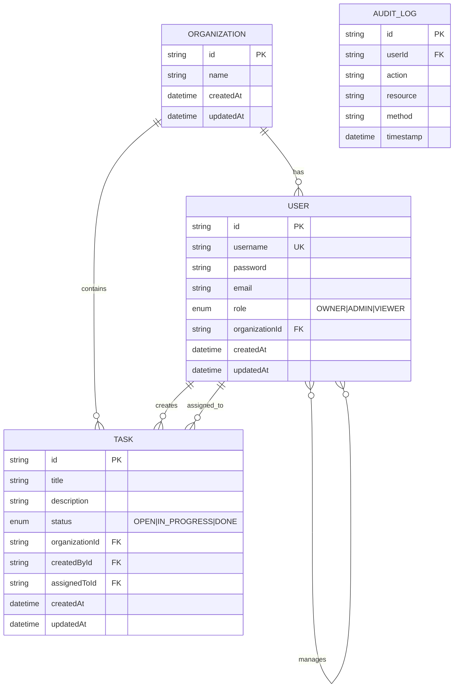

# Entity Relationship Diagram

## Database Schema Details

### Organization

- **Primary Key**: `id` (UUID)
- **Relationships**:
  - One-to-Many with Users
  - One-to-Many with Tasks

### User

- **Primary Key**: `id` (UUID)
- **Unique Constraint**: `username`
- **Roles**: OWNER, ADMIN, VIEWER
- **Relationships**:
  - Many-to-One with Organization
  - One-to-Many with Tasks (as creator)
  - One-to-Many with Tasks (as assignee)
  - Many-to-Many with Users (manager hierarchy)

### Task

- **Primary Key**: `id` (UUID)
- **Status Values**: OPEN, IN_PROGRESS, DONE
- **Relationships**:
  - Many-to-One with Organization
  - Many-to-One with User (creator)
  - Many-to-One with User (assignee)

### Audit Log

- **Primary Key**: `id` (UUID)
- **Purpose**: Track all user actions for security and compliance
- **Relationships**:
  - Many-to-One with User
